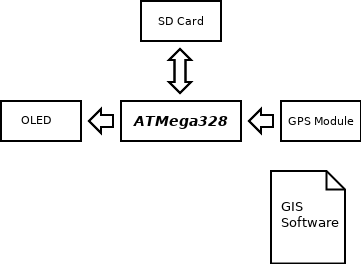

/*
Title: GPS Datalogger
Description: Atmega GPS Datalogger
Author: Butch Wayman(butchman0922@gmail.com)
Date: 2015/06/29
Robots: noindex,nofollow
Template: index
*/

## GPS Datalogger
Microcontroller based GPS Datalogger

### Home

-----

#### Introduction

        A simple microcontroller based GPS Datalogger for backpacking.

#### Inspiration

        Most of the wilderness areas that I backpack in have poorly marked trails.
    Therefore I do a lot of navigation with map and compass. Using that method
    usually gets me to where I want to go, however, in the past I have had no way of
    knowing what my actual route was and how close I stayed to my intended route. 
    With a GPS Datalogger I hope to be able to walk the my route using a map and
    compass and at the completion of the route download the GPS data and evaluate
    it using GIS mapping software such as Google Earth, Viking or Open Street Maps.  

### High Level Design

-----

#### Design Considerations

    * Simple to use - set and forget
    * Waterproof
    * Long lasting or rechargeable power supply
    * Function in dense forest

#### Relevant Standards

* <a href="http://www.gps.gov/technical/icwg/IS-GPS-200G.pdf">The Global Positioning System "GPS"</a>
* <a href="http://fort21.ru/download/NMEAdescription.pdf">Serial data network between MCU and GPS</a>
* <a href="https://www.sdcard.org/downloads/pls/part1_410.pdf">SPI interface as dictated by the standards of the SD Association</a>

### Hardware Design

-----

### Software Design

-----

### Results

-----

### Conclusion

-----

### Considerations

-----

### Appendices

-----

### References

-----

* <a href="http://www.gps.gov/technical/icwg/IS-GPS-200G.pdf">The Global Positioning System "GPS"</a>
* <a href="http://fort21.ru/download/NMEAdescription.pdf">Serial data network between MCU and GPS</a>
* <a href="https://en.wikipedia.org/wiki/Universal_asynchronous_receiver/transmitter">UART interface</a>
* <a href="https://en.wikipedia.org/wiki/Serial_Peripheral_Interface_Bus">SPI interface</a>
* <a href="http://people.ece.cornell.edu/land/courses/ece4760/FinalProjects/s2009/jsm66_mpk28/jsm66_mpk28/index.html">Cornell ECE Finals Project</a>
